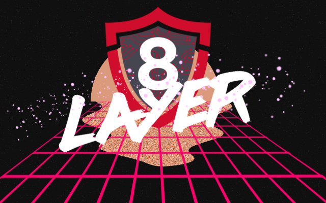

# CTF 101 -- Layer 8
Welcome to the CTF 101 event. This CTF in particular goes from 8am to 8pm on March 18, 2019. Please
have fun!

# Rules
1. Competitors shall not attempt to game the scoring engine.
2. Competitors shall obey the description of each challenge.
3. Competitors shall not attack the IP addresses or sites presented in some challenges.
4. Competitors shall do their best to solve the challenges.
5. Competitors shall not create multiple accounts to defy the hint engine.
6. Competitors shall only have one account with their student email.
7. Competitors shall have fun.
8. Competitors shall learn.

## What is a CTF?
A CTF is a learning experience. A CTF is a challenge to yourself, seeing how far you have gone and
what you have achieved. A CTF is something to work hours and hours on to figure out something that
might not appear somewhere regularly, but the details may come across some day to make something
tick. A CTF is a flag capturing game. Some people take it as a game, some people take it as a hobby
and some people take it as life.

`Capture The Flag (CTF).`

## Writeups
After a CTF is over, competitors usually like to write about how they approached the challenges and
it is acceptable. Do so if you wish to practice your writing skills.

## How does this work?
Our CTF is built with the ctfd engine containing 52 challenges. Simply, select the challenge
you wish, read the description and start solving it! By solving it, we mean to dig in, research and
figure out how to find the flag.

### Flag formats
The official layer 8 flag format is `L8-sometext-####` for example: `L8-flaglol-1234`. Some
challenges don't follow this structure, but that will be shown in the description. Don't hesitate to
ask if the flag is correct or not! But do not abuse that power. We will tell you if it is an
alternative format or not.

## Teams or Solo?
You can choose to conduct an alliance with multiple hackers or take on the path of the lone hacker
to claim the top prize to yourself! A team is just a single user.

# Prize list
* 1st : $50 Gift Card + Maker Uno Edu kit
* 2nd : $30 Gift Card
* 3rd : $20 Gift Card

# Terminology
* ```CTF : Capture The Flag.```
* ```Flag : The string of text that is required to be submitted to acquire your points.```
* ```Writeups : Post-CTF shared or private documentation.```

# CTF Categories
Network Analysis of packet captures (pcaps) with Wireshark.
Cryptography decoding.
Password Cracking*
Steganography
Web Exploitation
Reverse Engineering
and more!

**Not included in this game*

# Other CTFs
* [National Cyber League (NCL)](https://www.nationalcyberleague.org/)
* [OverTheWire](http://overthewire.org/)
* [HackTheBox](https://www.hackthebox.eu/)
* And more!

# About this repo
In this repo, you will see some tools and demos (screenshots) on how some things are done.

# Tools and useful info
* [CTFTime](https://ctftime.org/)
* [BurpSuite](https://portswigger.net/burp)
* [DirBuster](https://www.owasp.org/index.php/Category:OWASP_DirBuster_Project)
* [Kali Linux](https://www.kali.org/)

## Commandline tools:
* nmap
* grep
* cat
* ssh
* base64
* curl
* wget
* and more!

# Awesome! CTF repos:
* [awesome-ctf by apsdehal](https://github.com/apsdehal/awesome-ctf)
* [ctf-tools by zardus](https://github.com/zardus/ctf-tools)
* [CTF Tools by MrMugiwara](https://github.com/MrMugiwara/CTF-Tools)

# Conclusion
Have fun!
